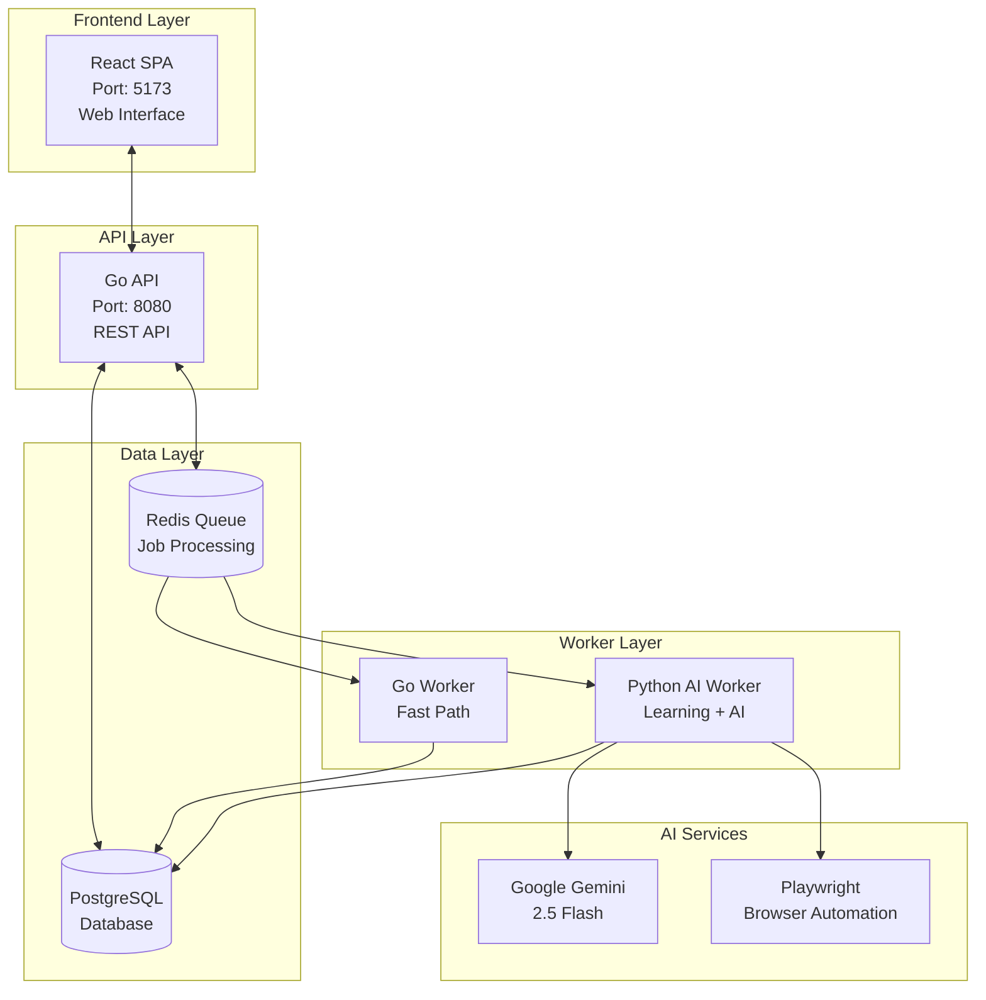

# Claude.md - Article Extraction System

**AI-powered article extraction system that converts web articles into LLM-friendly text format**

---

## 🎯 Project Overview

This system intelligently extracts clean article content from any website and transforms it into **LLM-friendly text format** by:

1. **Smart Content Extraction** - Removes navigation, ads, and noise while preserving article content
2. **AI-Powered Learning** - Automatically learns extraction rules for new websites (one-time per domain)
3. **Image-to-Text Transformation** - Converts charts, graphs, and images into detailed text descriptions
4. **Template-Based Optimization** - Reuses learned rules for fast, cost-effective extraction

### **Core Innovation: Inverted Learning**
Instead of trying to find what content to keep, the system learns what noise to remove:
- Extract everything → Identify noise patterns → Generate exclusion selectors → Validate quality

---

## 🏗️ System Architecture

### **Multi-Language Distributed System**



### **Key Components**

#### **Frontend Layer**
- **React SPA** - Modern web interface for testing and quality comparison
- **Real-time Updates** - WebSocket integration for job monitoring
- **Quality Comparison** - Side-by-side Go vs Python worker results

#### **API Layer**
- **Go API** - High-performance REST API with Fiber framework
- **Authentication** - JWT-based user management
- **Job Management** - Queue processing and status tracking

#### **Worker Layer**
- **Go Worker** - Fast extraction using existing templates
- **Python AI Worker** - Site learning and image description generation
- **Smart Routing** - Automatic worker selection based on site configuration

#### **Data Layer**
- **PostgreSQL** - Job management, site configurations, user data
- **Redis** - Job queuing, caching, real-time updates
- **File Storage** - Extracted content and generated descriptions

---

## 🧠 AI Integration & Learning Process

### **Two-Phase AI Usage**

#### **Phase 1: Site Learning (One-time per domain)**
```
New Site → Python AI Worker → Gemini Learning → Create Template → Store Config
```
- **Cost**: ~$0.05 per new site (one-time learning)
- **Output**: YAML template with extraction rules
- **Storage**: Database for future reuse

#### **Phase 2: Normal Operation (Per article)**
```
Known Site → Go Worker → Load Template → Extract Content → AI Image Descriptions
```
- **Cost**: Minimal (only image processing)
- **Speed**: Fast template-based extraction
- **AI Usage**: Only for image-to-text transformation

### **Inverted Learning Algorithm**

1. **Download & Analyze** - Fetch page content and analyze HTML structure
2. **Boundary Detection** - AI identifies article start/end markers
3. **Noise Identification** - AI finds navigation, ads, related content patterns
4. **Iterative Refinement** - Improve rules based on validation feedback
5. **Template Generation** - Save YAML configuration for future use

### **Image-to-Text Transformation**

**Google Gemini Vision API** converts visual content to detailed text:
- **Charts & Graphs** → Comprehensive data descriptions
- **Diagrams** → Step-by-step process explanations  
- **Screenshots** → Contextual interface descriptions
- **Infographics** → Structured information breakdown

**Example Transformation:**
```markdown
<!-- Before -->


<!-- After -->
**Sales Growth Chart**: This line chart shows quarterly revenue growth from Q1 2023 to Q4 2023. The chart displays a steady upward trend with revenue increasing from $2.1M in Q1 to $3.8M in Q4, representing an 81% year-over-year growth. The growth rate appears to be accelerating in Q3 and Q4, with the steepest increase occurring between Q3 ($2.9M) and Q4 ($3.8M)...
```

---

## 🛠️ Technology Stack

### **Backend Technologies**
- **Python 3.8+** - Core extraction logic, AI integration
- **Go 1.24+** - High-performance API and fast worker
- **PostgreSQL** - Database for jobs and site configurations
- **Redis** - Job queuing and caching
- **Google Gemini 2.5 Flash** - AI learning and image descriptions

### **Frontend Technologies**
- **React 18** - Modern UI framework
- **TypeScript** - Type safety and development experience
- **Vite** - Fast build tool and dev server
- **React Query** - Server state management
- **Tailwind CSS** - Utility-first styling
- **WebSocket** - Real-time updates

### **Key Libraries**
- **BeautifulSoup** - HTML parsing and manipulation
- **Playwright** - Browser automation for JavaScript sites
- **Fiber** - Fast Go web framework
- **Asynq** - Go job queue processing
- **React Router** - Client-side routing

---

## 📁 Project Structure

```
article-2-text/
├── src/                          # Python core extraction logic
│   ├── article_extractor.py      # Main CLI entry point
│   ├── site_registry.py          # Site configuration management
│   ├── inverted_learning.py      # AI-powered learning engine
│   └── extraction_engine.py      # Unified extraction logic
├── api/                          # Go REST API
│   ├── cmd/api/main.go           # API server entry point
│   ├── internal/                 # API business logic
│   └── go.mod                    # Go dependencies
├── worker-go/                    # Go worker (fast path)
│   ├── cmd/worker/main.go        # Worker entry point
│   └── internal/                 # Worker logic
├── worker-python/                # Python AI worker
│   ├── app/main.py               # AI worker entry point
│   └── requirements.txt          # Python dependencies
├── frontend/                     # React SPA
│   ├── src/                      # React source code
│   ├── package.json              # Node dependencies
│   └── vite.config.ts         # Vite configuration
├── config/                       # Site configurations
│   └── sites/                    # Learned site templates
├── docs/                         # Comprehensive documentation
└── results/                      # Extracted content output
```

---

## 🚀 Deployment Options

### **1. Python CLI (Simple)**
```bash
# Extract single article with AI learning
python src/article_extractor.py --gemini https://example.com/article

# Batch processing
python src/article_extractor.py --batch urls.txt
```

### **2. Full Service (Production)**
```bash
# Start all services
./start-system.sh

# Services:
# - Go API (Port 8080)
# - React Frontend (Port 5173)  
# - Go Worker (Background)
# - Python AI Worker (Port 8081)
# - PostgreSQL + Redis
```

### **3. Web Interface (Testing)**
```bash
# Start frontend for quality testing
cd frontend && npm run dev
# Access: http://localhost:5173
```

---

## 🤖 Agent Usage & Development Workflow

### **Configured Global Agents**

This project is designed to work with your configured global agents:

- **`fullstack-web-developer`** - Comprehensive web development (React, Go, Python, databases)
- **`solution-architect`** - System design, data flow optimization, architectural decisions
- **`system-test-runner`** - End-to-end testing, service management, validation
- **`ui-ux-auditor`** - Interface design, usability analysis, UX optimization

### **How to Instruct Claude to Use Agents**

When working on this project, use these specific instructions to leverage your configured agents:

#### **For Full-Stack Development:**
```
Use the fullstack-web-developer agent to:
- Implement new API endpoints with database integration
- Add React components with proper state management
- Integrate Python AI worker functionality
- Review code for best practices and standards compliance
- Debug extraction issues across all components
```

#### **For Architecture & System Design:**
```
Use the solution-architect agent to:
- Design new system components and data flow patterns
- Plan database schema changes and optimization
- Make strategic decisions about project direction
- Resolve implementation roadblocks with architectural solutions
- Refactor complex features for better maintainability
```

#### **For Comprehensive Testing:**
```
Use the system-test-runner agent to:
- Perform end-to-end testing of the complete extraction workflow
- Test service restarts and system recovery
- Validate web UI interactions and real-time updates
- Monitor logs and file validation
- Test extraction quality across multiple sites
- Verify AI learning accuracy and performance
```

#### **For UI/UX Design & Optimization:**
```
Use the ui-ux-auditor agent to:
- Design and review the React testing interface
- Analyze usability of quality comparison tools
- Optimize real-time monitoring displays
- Improve debugging workflows and user experience
- Audit interface performance and accessibility
```

### **Agent-Specific Project Context**

When instructing agents, provide this project context:

```
This is an Article Extraction System with:
- Python core (AI learning, extraction logic)
- Go API (REST endpoints, fast worker)
- React frontend (testing interface)
- PostgreSQL + Redis (data layer)
- Multi-worker architecture (Go for speed, Python for AI)

Key focus: LLM-friendly text output with image-to-text transformation
```

### **Specific Agent Usage Examples**

#### **Full-Stack Developer Examples:**
```
"Use the fullstack-web-developer agent to implement a new batch processing API endpoint that accepts multiple URLs and returns extraction results with proper error handling and database integration."

"Use the fullstack-web-developer agent to review this React component that displays extraction results and suggest improvements for state management and user experience."

"Use the fullstack-web-developer agent to debug why the Python AI worker is not properly saving site configurations to the database."
```

#### **Solution Architect Examples:**
```
"Use the solution-architect agent to design a caching layer for site templates to improve extraction performance and reduce database load."

"Use the solution-architect agent to analyze the current worker routing logic and propose a more efficient system for handling high-volume extraction requests."

"Use the solution-architect agent to design a microservices architecture for scaling the system to handle thousands of concurrent extractions."
```

#### **System Test Runner Examples:**
```
"Use the system-test-runner agent to perform comprehensive testing of the complete extraction workflow from API request to final markdown output, including service restarts and error recovery."

"Use the system-test-runner agent to test the system with 50 different news websites and validate that all extractions produce clean, LLM-friendly output."

"Use the system-test-runner agent to verify that the WebSocket real-time updates work correctly during long-running extraction jobs."
```

#### **UI/UX Auditor Examples:**
```
"Use the ui-ux-auditor agent to review the React testing interface and suggest improvements for the quality comparison tools and real-time monitoring displays."

"Use the ui-ux-auditor agent to design a better user experience for debugging extraction issues, including visual feedback and error reporting."

"Use the ui-ux-auditor agent to audit the accessibility of the web interface and ensure it works well with screen readers and keyboard navigation."
```

---

## 🧪 Testing Approach & Acceptance Criteria

### **Testing Strategy**

#### **1. System Test Runner Approach**
```
Use the system-test-runner agent to:
- Test complete extraction workflow from UI/API to final output
- Validate AI learning process for new sites
- Test template-based optimization for known sites
- Verify image-to-text transformation quality
- Test error handling and recovery scenarios
```

#### **2. MCP Tools for Testing**
```
Use MCP tools for comprehensive testing:
- "chrome-devtools" - Browser automation and UI testing
- "postgres" - Database operations and data validation
- "redis" - Queue management and job processing
```

#### **3. Test Account Access**
```
Test Account Credentials:
- Email: test@example.com
- Password: password123
- Use this account for UI testing and authentication
```

#### **2. Multi-Layer Testing**

**Layer 1: Component Testing**
- Python CLI extraction (individual components)
- Go API endpoints (authentication, job management)
- React frontend (UI interactions, real-time updates)
- Database operations (job storage, site configurations)

**Layer 2: Integration Testing**
- API → Worker → Database flow
- Frontend → API → Worker communication
- WebSocket real-time updates
- Cross-component error handling

**Layer 3: End-to-End Testing**
- Complete extraction workflow from UI to final markdown
- AI learning process for new sites
- Template-based extraction for known sites
- Quality validation and error recovery

### **Acceptance Criteria for Meaningful Content Extraction**

#### **Content Quality Standards**

**1. Article Completeness**
- ✅ **Full article text** - No truncated content
- ✅ **Proper structure** - Headings, paragraphs, lists maintained
- ✅ **Metadata accuracy** - Title, author, date correctly extracted
- ✅ **Word count validation** - Minimum 500 words for articles

**2. Noise Removal Effectiveness**
- ❌ **No navigation menus** - Remove site navigation, breadcrumbs
- ❌ **No advertisements** - Remove ads, sponsored content
- ❌ **No related articles** - Remove "you might also like" sections
- ❌ **No social sharing** - Remove share buttons, social widgets
- ❌ **No comments sections** - Remove user comments, discussion threads
- ❌ **No footer content** - Remove site footers, legal text

**3. LLM-Friendly Format**
- ✅ **Clean Markdown** - Proper formatting, no HTML artifacts
- ✅ **Image descriptions** - Detailed text for all visual content
- ✅ **Accessible content** - Screen reader friendly
- ✅ **Structured data** - Clear headings, logical flow

#### **Technical Validation Criteria**

**1. Extraction Success Rate**
- **Target**: 90%+ successful extractions
- **Measurement**: Clean content vs. noise ratio
- **Validation**: Manual review of sample extractions

**2. AI Learning Accuracy**
- **Target**: 85%+ success rate for new sites
- **Measurement**: Template effectiveness on first try
- **Validation**: Test on 20+ different news sites

**3. Performance Standards**
- **Learning time**: <3 minutes per new site
- **Extraction speed**: <10 seconds for known sites
- **Template reuse**: 95%+ of extractions use cached templates

#### **Content Quality Validation**

**1. Manual Review Checklist**
```
For each extracted article, verify:
□ Article title is accurate and complete
□ Author information is present and correct
□ Publication date is extracted
□ Main content is complete (no truncation)
□ No navigation menus in content
□ No advertisements in content
□ No related articles in content
□ No social sharing buttons in content
□ No comments sections in content
□ Images have descriptive text
□ Markdown formatting is clean
□ Content is readable and coherent
```

**2. Automated Quality Checks**
- **Content length validation** - Minimum 500 words
- **Structure validation** - Proper heading hierarchy
- **Noise detection** - Check for navigation patterns
- **Metadata completeness** - Title, author, date present
- **Image description quality** - Detailed, context-aware descriptions

#### **Test Site Categories**

**1. News Sites (Primary Focus)**
- **CNN, BBC, Reuters** - Major news organizations
- **TechCrunch, Wired** - Technology publications
- **Forbes, Bloomberg** - Business news
- **Local news sites** - Regional publications

**2. Blog Platforms**
- **WordPress sites** - Common blog platform
- **Medium articles** - Popular publishing platform
- **Substack newsletters** - Newsletter format
- **Personal blogs** - Individual author sites

**3. Complex Sites**
- **JavaScript-heavy sites** - Dynamic content loading
- **Paywall sites** - Subscription-based content
- **Multi-language sites** - International publications
- **Mobile-optimized sites** - Responsive design

#### **Error Handling & Recovery**

**1. Extraction Failures**
- **Network timeouts** - Retry with exponential backoff
- **JavaScript errors** - Fallback to static HTML
- **AI learning failures** - Manual template creation
- **Database errors** - Graceful degradation

**2. Quality Issues**
- **Poor extraction quality** - Re-learn site configuration
- **Missing metadata** - Fallback extraction methods
- **Image description failures** - Context-based descriptions
- **Template ineffectiveness** - Force re-learning

### **Testing Workflow**

#### **Phase 1: System Test Runner Validation**
```
Use the system-test-runner agent to:
1. Test complete system startup (all services)
2. Verify database connections and Redis queue using MCP tools
3. Test API authentication and job creation
4. Validate worker processing and job completion
5. Test frontend UI interactions and real-time updates using chrome-devtools
6. Verify file storage and result retrieval
7. Use test account (test@example.com / password123) for authentication
```

#### **Phase 2: Content Quality Testing**
```
Use the system-test-runner agent to:
1. Test extraction on 20+ different news sites using chrome-devtools
2. Validate AI learning process for new sites
3. Test template-based extraction for known sites
4. Verify image-to-text transformation quality
5. Test error handling and recovery scenarios
6. Validate content quality against acceptance criteria
7. Use MCP postgres tool to verify database operations
8. Use MCP redis tool to monitor job queue processing
```

#### **Phase 3: Performance & Scalability Testing**
```
Use the system-test-runner agent to:
1. Test concurrent extraction requests using chrome-devtools
2. Validate worker performance under load
3. Test database performance with large datasets using MCP postgres
4. Verify system stability during long-running operations
5. Test memory usage and resource optimization
6. Validate error recovery and system resilience
7. Monitor Redis queue performance using MCP redis tool
8. Use test account for authentication during load testing
```

---

## 🔧 Development Workflow

### **Common Development Tasks**

#### **Adding New Site Support**
1. **Test extraction** - Use Python CLI with `--learn` flag
2. **Validate quality** - Check extracted content in results/
3. **Debug issues** - Use web interface for side-by-side comparison
4. **Template optimization** - Refine YAML configuration if needed

#### **Debugging Extraction Issues**
1. **Check site config** - Look in `config/sites/{domain}.yaml`
2. **Compare workers** - Use React frontend for Go vs Python results
3. **Validate HTML** - Use browser dev tools to inspect selectors
4. **Re-learn site** - Force re-learning with `--force-renew` flag

#### **API Development**
1. **Start API** - `cd api && go run cmd/api/main.go`
2. **Test endpoints** - Use provided test scripts or Postman
3. **Monitor logs** - Check `api/api.log` for request/response details
4. **Database queries** - Use PostgreSQL client for data inspection

#### **Frontend Development**
1. **Start dev server** - `cd frontend && npm run dev`
2. **API integration** - Update `src/lib/api.ts` for new endpoints
3. **Component testing** - Use React dev tools for state inspection
4. **Real-time updates** - Test WebSocket connections in browser

### **Testing Strategy**

#### **Unit Testing**
- **Python**: `pytest tests/` for extraction logic
- **Go**: `go test ./...` for API and worker logic
- **React**: `npm test` for component testing

#### **Integration Testing**
- **End-to-end**: Full extraction workflow testing
- **API testing**: REST endpoint validation
- **Worker testing**: Job processing verification
- **Database testing**: Data persistence and retrieval

#### **Quality Assurance**
- **Extraction quality**: Manual review of extracted content
- **Image descriptions**: Validate AI-generated text accuracy
- **Performance testing**: Load testing for concurrent extractions
- **Error handling**: Graceful failure and recovery testing

---

## 📊 Key Metrics & Monitoring

### **Performance Metrics**
- **Learning time**: 30-180 seconds per new site
- **Extraction speed**: <5 seconds for known sites
- **Template reuse**: 95%+ of extractions use cached templates
- **AI cost**: ~$0.05 per new site, minimal for image processing

### **Quality Metrics**
- **Extraction accuracy**: 90%+ clean content extraction
- **Image description quality**: Detailed, context-aware descriptions
- **Template effectiveness**: 85%+ success rate for learned sites
- **User satisfaction**: Quality comparison tools for validation

### **System Health**
- **Database connections**: PostgreSQL pool monitoring
- **Redis queue**: Job processing status
- **Worker health**: Go and Python worker availability
- **API performance**: Response times and error rates

---

## 🎯 Use Cases & Applications

### **Content Processing**
- **LLM Training Data** - Clean, text-optimized articles for model training
- **Accessibility** - Screen reader friendly content with image descriptions
- **Content Analysis** - Text-based analysis of visual content
- **Audio Generation** - Text-to-speech from articles with image descriptions

### **Research & Development**
- **Academic Research** - Process articles for text analysis
- **Content Monitoring** - Track competitor content across sites
- **Visual Content Analysis** - Understand charts and graphs as text
- **Data Extraction** - Convert visual data to structured text

### **Business Applications**
- **Content Aggregation** - Collect articles from multiple sources
- **Market Research** - Analyze industry content and trends
- **Documentation** - Convert web content to structured documentation
- **Knowledge Management** - Create searchable text databases

---

## 🔒 Security & Best Practices

### **Authentication**
- **JWT tokens** for API authentication
- **API key management** for external access
- **User tier system** with credit limits
- **Rate limiting** to prevent abuse

### **Data Protection**
- **Input validation** for all user inputs
- **SQL injection prevention** with parameterized queries
- **XSS protection** in frontend rendering
- **Secure file handling** for extracted content

### **Performance Optimization**
- **Template caching** for fast repeated extractions
- **Connection pooling** for database efficiency
- **Job queuing** for scalable processing
- **Resource monitoring** for system health

---

## 📚 Documentation Structure

The project includes comprehensive documentation in `/docs/`:

- **Getting Started** - Installation and setup guides
- **Usage Guides** - How to use each interface (CLI, API, Web)
- **Technical Documentation** - Deep dive into system architecture
- **Development** - Contributing and testing procedures

**Start with**: `docs/index.md` for complete documentation overview

---

## 🤝 Contributing

### **Development Setup**
1. **Clone repository** and install dependencies
2. **Set up environment** with required API keys
3. **Run tests** to verify setup
4. **Follow coding standards** for each language
5. **Update documentation** for new features

### **Code Standards**
- **Python**: PEP 8 style guide with type hints
- **Go**: Standard Go formatting with proper error handling
- **React**: ESLint configuration with TypeScript
- **Documentation**: Markdown with clear structure and examples

---

## 🎉 Recent Updates & Status

**System Status**: ⚠️ **PARTIALLY OPERATIONAL**
- ✅ Python CLI working (basic extraction)
- ✅ Go API running (authentication, job management)
- ✅ React frontend running (UI interface)
- ❌ **Article extraction failing** (main purpose not working)
- ❌ **UI extraction workflow broken**
- ❌ **API extraction endpoints failing**
- ⚠️ AI learning system needs validation
- ⚠️ Template-based optimization needs testing

**Critical Issues**: 
- Article extraction not working from UI/API
- Need to validate AI learning process
- Need to test template-based optimization
- Need to verify image-to-text transformation

**Last Updated**: October 2025 - System components running but core functionality needs debugging

---

**This system represents a sophisticated solution for intelligent article extraction with AI-powered learning and LLM-friendly output generation.**
