```mermaid
graph TD
    A[Article Extraction Tester] --> B[API Key] 
    A --> C[Logout]
    A --> D[Extract New Article]
    D --> E[URL Input Field]
    D --> F[Extract Article Button]
    A --> G[Recent Extractions]
    G --> H[🟢 SaaS Metrics 2.0<br/>8,391 words • 29 images • 10s<br/>2 min ago<br/>View Download]
    G --> I[🟡 Startup Killer<br/>Processing...<br/>Progress: 50%]
    G --> J[🔴 Invalid URL<br/>Failed<br/>Error: 404 Not Found]
```

```mermaid
graph TD
    A[← Back to Dashboard] --> B[SaaS Metrics 2.0 - A Guide to Measuring...]
    B --> C[Status: ✅ Completed • 10.2s • 2 min ago]
    B --> D[📊 Metadata]
    D --> E[• URL: forentrepreneurs.com/saas-metrics-2<br/>• Domain: forentrepreneurs.com<br/>• Word Count: 8,391<br/>• Images: 29<br/>• Credits Used: 1]
    B --> F[Download Markdown] 
    B --> G[View Comparison]
    B --> H[📄 Preview]
    H --> I[# SaaS Metrics 2.0<br/>**Author:** David Skok<br/>---<br/>Skip to content<br/>Posts<br/>Categories<br/>...]
    B --> J[⚠️ Quality Warning]
    J --> K[• Content appears to include navigation menus<br/>• Detected 127 extra words vs typical content]
    B --> L[View Full Content]
    B --> M[Download]
```

# UI Implementation Plan - Article Extraction Testing Interface

**Purpose**: React SPA for testing and debugging Go worker extraction quality  
**Target Users**: Developers/admins testing the system  
**Focus**: Quality comparison, debugging, API key management

---

## 🎯 MVP Features (Week 1)

### **1. Authentication (Simple)**
- Login form (email + password)
- Store JWT token in localStorage
- Auto-redirect to dashboard if logged in
- Logout button

**No registration UI needed** - users created via API or database directly

---

### **2. Dashboard (Main Screen)**

**Layout:**


**Features:**
- Big URL input + extract button
- Live job list with auto-refresh (polling every 2s)
- Status indicators (🟢 completed, 🟡 processing, 🔴 failed)
- Quick actions (view, download)

---

### **3. Job Detail Page**

**URL:** `/job/:jobId`

**Layout:**


**Features:**
- Markdown preview (rendered or code view toggle)
- Metadata display
- Download button
- Quality warnings (detect common issues)
- Link to comparison view

---

### **4. Comparison View**

**URL:** `/job/:jobId/compare`

**Purpose:** Compare Go worker output with Python baseline (from `/results`)

**Layout:**


**Features:**
- Side-by-side view
- Highlight differences (navigation, JS code)
- Quality metrics comparison
- Line-by-line diff option

**Technical Note:**
- Go worker output: Fetch from `/storage/{filename}.md`
- Python baseline: Read from `/results/` directory (match by title/URL)
- If no baseline exists, show "No baseline for comparison"

---

### **5. API Key Page**

**URL:** `/api-key`

**Layout:**
```mermaid
graph TD
    A[API Key Management] --> B[Your API Key]
    B --> C[ak_live_a1b2c3d4e5f6g7h8i9j0 📋]
    B --> D[Copy to Clipboard]
    A --> E[Usage This Month]
    E --> F[• Extractions: 42<br/>• Credits Used: 42 / 10,000<br/>• Success Rate: 85.7%]
    A --> G[📖 API Documentation]
    G --> H[# Extract an article<br/>curl -X POST http://localhost:8080/api/v1/extract/single<br/>-H "X-API-Key: ak_live_..."<br/>-H "Content-Type: application/json"<br/>-d '{"url":"https://example.com/article"}']
    G --> I[# Check job status<br/>curl http://localhost:8080/api/v1/jobs/{jobId}<br/>-H "X-API-Key: ak_live_..."]
```

---

## 🏗️ Technical Architecture

### **Project Structure**

```
frontend/
├── src/
│   ├── main.tsx              # Entry point
│   ├── App.tsx               # Router setup
│   ├── components/
│   │   ├── ui/               # Shadcn components
│   │   ├── Layout.tsx        # Nav, header, footer
│   │   ├── JobCard.tsx       # Job list item
│   │   ├── MarkdownPreview.tsx
│   │   └── ComparisonView.tsx
│   ├── pages/
│   │   ├── Login.tsx
│   │   ├── Dashboard.tsx
│   │   ├── JobDetail.tsx
│   │   ├── JobComparison.tsx
│   │   └── ApiKey.tsx
│   ├── lib/
│   │   ├── api.ts            # API client
│   │   ├── auth.ts           # Auth helpers
│   │   └── utils.ts          # Utilities
│   └── types/
│       └── index.ts          # TypeScript types
├── public/
├── index.html
├── package.json
├── vite.config.ts
├── tailwind.config.js
└── tsconfig.json
```

### **API Integration**

**Endpoints to use:**
```typescript
// Auth
POST /api/v1/auth/login
  Body: { email, password }
  Returns: { token, user }

// Jobs
POST /api/v1/extract/single
  Headers: { Authorization: Bearer <token> }
  Body: { url }
  Returns: { job }

GET /api/v1/jobs?limit=20&offset=0
  Headers: { Authorization: Bearer <token> }
  Returns: { jobs: [...], count }

GET /api/v1/jobs/:jobId
  Headers: { Authorization: Bearer <token> }
  Returns: { job }

// Files
GET /storage/{filename}.md
  Returns: markdown content (direct file access)

GET /results/{filename}.md
  Returns: baseline markdown (direct file access)
```

### **State Management**

Use **React Query** for:
- Automatic refetching
- Caching
- Loading states
- Error handling

```typescript
// Example: Fetch jobs
const { data, isLoading } = useQuery({
  queryKey: ['jobs'],
  queryFn: fetchJobs,
  refetchInterval: 2000, // Poll every 2s for live updates
});
```

### **Quality Detection Algorithm**

```typescript
function detectQualityIssues(markdown: string): Issue[] {
  const issues: Issue[] = [];
  
  // Check for navigation patterns
  const navPatterns = [
    /Skip to content/i,
    /Posts.*Categories.*Tags/s,
    /Home.*About.*Contact/s,
  ];
  if (navPatterns.some(p => p.test(markdown))) {
    issues.push({
      type: 'navigation',
      severity: 'high',
      message: 'Navigation menus detected in content'
    });
  }
  
  // Check for JavaScript
  if (markdown.includes('hbspt.forms') || markdown.includes('portalId')) {
    issues.push({
      type: 'javascript',
      severity: 'high',
      message: 'JavaScript code not removed'
    });
  }
  
  // Check content position
  const firstHeading = markdown.indexOf('\n## ');
  if (firstHeading > 1000) {
    issues.push({
      type: 'structure',
      severity: 'medium',
      message: 'Content starts too late (possible header garbage)'
    });
  }
  
  return issues;
}
```

---

## 🚀 Implementation Steps

### **Step 1: Project Setup (30 min)**

```bash
cd /path/to/article-2-text
npm create vite@latest frontend -- --template react-ts
cd frontend
npm install

# Install dependencies
npm install react-router-dom @tanstack/react-query
npm install axios date-fns
npm install react-markdown remark-gfm
npm install diff

# Install Tailwind + Shadcn
npm install -D tailwindcss postcss autoprefixer
npx tailwindcss init -p
npx shadcn-ui@latest init

# Add specific components
npx shadcn-ui@latest add button
npx shadcn-ui@latest add card
npx shadcn-ui@latest add input
npx shadcn-ui@latest add badge
npx shadcn-ui@latest add alert
```

### **Step 2: Core Files (1 hour)**

1. **API Client** (`src/lib/api.ts`)
   - Axios instance with auth header
   - Error handling
   - Type-safe methods

2. **Auth Context** (`src/lib/auth.tsx`)
   - Login/logout
   - Token storage
   - Protected routes

3. **Types** (`src/types/index.ts`)
   - Job, User, ApiResponse types

### **Step 3: Pages (2-3 hours)**

1. **Login** - Simple form
2. **Dashboard** - URL input + job list
3. **Job Detail** - Preview + metadata
4. **Comparison** - Side-by-side view
5. **API Key** - Display key + usage

### **Step 4: Components (1-2 hours)**

1. **Layout** - Header, nav, container
2. **JobCard** - Reusable job display
3. **MarkdownPreview** - Syntax-highlighted preview
4. **StatusBadge** - Color-coded status
5. **ComparisonView** - Side-by-side diff

### **Step 5: Integration & Testing (1 hour)**

1. Connect to Go API (localhost:8080)
2. Test all flows
3. Handle edge cases
4. Polish UI

---

## 🎨 Design System

### **Colors (Tailwind)**
- Primary: Blue-600
- Success: Green-500
- Warning: Yellow-500
- Error: Red-500
- Neutral: Gray-800/600/400

### **Status Colors**
- 🟢 Completed: green
- 🟡 Processing: yellow
- 🔴 Failed: red
- ⚪ Queued: gray

### **Typography**
- Headings: font-bold
- Body: font-normal
- Code: font-mono

---

## 📦 Deliverables

**By end of Week 1:**
- [x] Working React app
- [x] Login + auth
- [x] Extract articles via UI
- [x] View job results
- [x] Download markdown
- [x] Basic comparison view
- [x] API key display

**Total Estimate:** 6-8 hours of development

---

## 🔧 Configuration

### **Environment Variables**

Create `frontend/.env`:
```env
VITE_API_URL=http://localhost:8080
```

### **Vite Proxy** (for CORS in dev)

`vite.config.ts`:
```typescript
export default defineConfig({
  server: {
    proxy: {
      '/api': {
        target: 'http://localhost:8080',
        changeOrigin: true,
      },
      '/storage': {
        target: 'http://localhost:8080',
        changeOrigin: true,
      }
    }
  }
})
```

---

## 🚦 Ready to Build

Next step: Create the React project and start implementing!

Should I proceed with:
1. Creating the project structure
2. Setting up dependencies
3. Building the core authentication + dashboard

?


