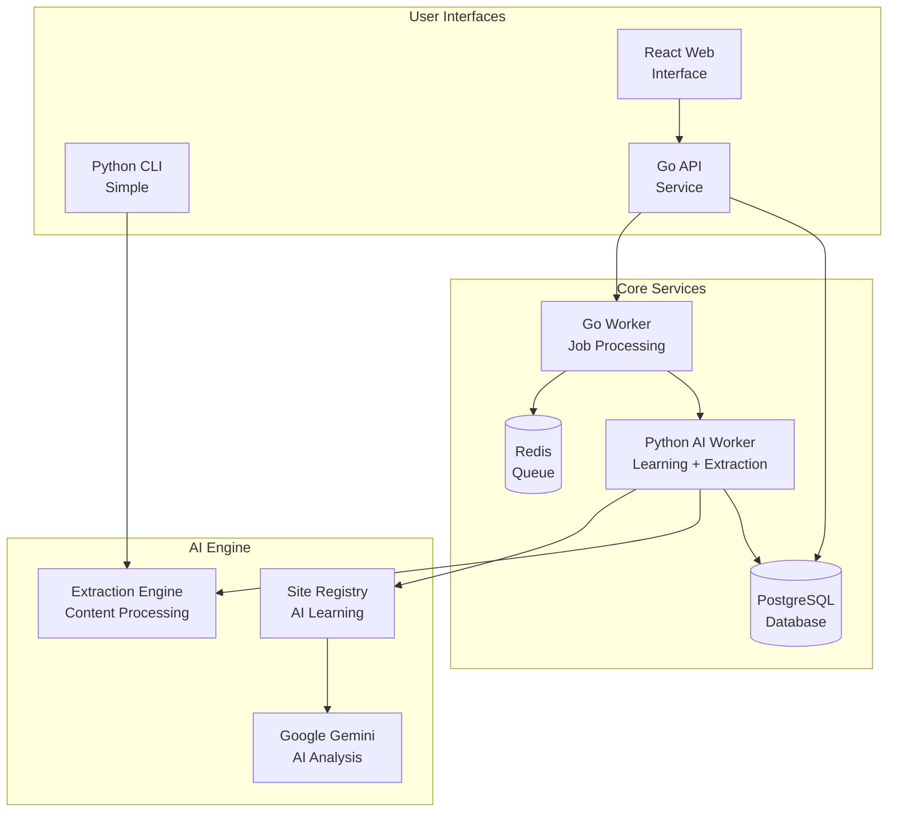

# Article Extraction System

**Intelligent article extraction with AI-powered learning and multiple deployment options.**

---

## 🎯 What This System Does

This system extracts clean, readable content from web articles and converts them to Markdown format. It's designed to handle the complexity of modern websites with navigation menus, ads, and dynamic content.

### **Key Features**
- **Smart Learning**: Automatically learns how to extract content from new websites
- **AI-Powered**: Uses Google Gemini to generate image descriptions and improve extraction
- **Multiple Interfaces**: Python CLI, REST API, and web frontend
- **Quality Control**: Compares extraction results and detects issues
- **Flexible Deployment**: Use as a simple CLI tool or deploy as a full service

---

## 🏗️ How It Works

### **The Core Problem**
Modern websites are complex. A typical article page contains:
- The actual article content
- Navigation menus
- Sidebar content
- Social sharing buttons
- Related articles
- Advertisements
- Comments sections

Our system needs to identify and extract **only** the article content while filtering out everything else.

### **Our Solution: Inverted Learning**

Instead of trying to find the content (which varies by site), we:

1. **Start with everything** - Extract the entire page content
2. **Learn what to remove** - Use AI to identify noise patterns
3. **Iteratively improve** - Remove unwanted content step by step
4. **Validate results** - Check if the remaining content is clean

This approach works better because:
- It's easier to identify what to remove than what to keep
- It adapts to different website structures automatically
- It learns from mistakes and improves over time

### **System Architecture**



---

## 🚀 Three Ways to Use This System

### **1. Python CLI (Simplest)**
Perfect for personal use, research, or small-scale extraction:

```bash
# Extract a single article
python src/article_extractor.py https://example.com/article

# Learn from a new site
python src/article_extractor.py --learn https://newsite.com/article
```

**Best for**: Researchers, content creators, personal projects

### **2. REST API (Programmatic)**
Full service with database, authentication, and job management:

```bash
# Start all services
cd api && go run cmd/api/main.go &
cd worker-go && go run cmd/worker/main.go &
cd worker-python && source venv/bin/activate && python app/main.py &
cd frontend && npm run dev &

# Extract via API
curl -X POST http://localhost:8080/api/v1/extract/single \
  -H "Authorization: Bearer your-token" \
  -d '{"url":"https://example.com/article"}'
```

**Best for**: Applications, integrations, team use

### **3. Web Interface (Visual)**
React frontend for testing and quality comparison:

```bash
# Start the frontend (runs on port 5173)
cd frontend && npm run dev
```

**Best for**: Testing, debugging, quality assurance

---

## 🧠 The Learning Process

### **How Sites Are Learned**

1. **Initial Extraction**: Download the page and extract all content
2. **AI Analysis**: Use Gemini to identify the main article container
3. **Noise Detection**: Find patterns in unwanted content (navigation, ads, etc.)
4. **Iterative Refinement**: Remove noise step by step
5. **Validation**: Check if the result is clean and complete
6. **Configuration Save**: Store the learned rules for future use

### **What Gets Learned**

- Main content selectors
- Exclusion patterns for noise removal
- Metadata extraction rules (title, author, date)
- Browser requirements (for JavaScript-heavy sites)
- Quality validation criteria

---

## 📊 Quality Control

### **Automatic Quality Detection**

The system detects common extraction issues:
- Navigation menus in content
- JavaScript code not removed
- Incomplete article extraction
- Missing metadata
- Poor content structure

### **Comparison Features**

When using the web interface, you can:
- Compare Go worker vs Python worker results
- See side-by-side extraction quality
- Identify which approach works better for specific sites
- Download and analyze results

---

## 🛠️ Technology Stack

### **Core Technologies**
- **Python**: Main extraction logic and AI integration
- **Go**: High-performance API and fast worker
- **React**: Modern web interface
- **PostgreSQL**: Database for jobs and configurations
- **Redis**: Job queue and caching
- **Google Gemini**: AI for learning and image descriptions

### **Key Libraries**
- **BeautifulSoup**: HTML parsing and manipulation
- **Playwright**: Browser automation for JavaScript sites
- **Fiber**: Fast Go web framework
- **React Query**: Frontend state management

---

## 🎯 Use Cases

### **Content Research**
- Extract articles for analysis
- Build content databases
- Monitor competitor content

### **Content Processing**
- Convert articles to Markdown
- Generate clean text for AI training
- Prepare content for publishing

### **Quality Assurance**
- Test extraction quality across sites
- Compare different extraction methods
- Debug extraction issues

### **API Integration**
- Build applications that need article extraction
- Create content processing pipelines
- Integrate with existing workflows

---

## 🚀 Getting Started

Choose your path:

### **Quick Start (Python CLI)**
```bash
# Install dependencies
pip install -r requirements.txt

# Extract your first article (with AI learning)
python src/article_extractor.py --gemini https://www.forentrepreneurs.com/top-two-reasons-for-churn/

# Find your result
ls results/
```

### **Full Service Setup**
```bash
# 1. Set up database
createdb article_extraction

# 2. Start Redis
redis-server

# 3. Start all services
cd api && go run cmd/api/main.go &
cd worker-go && go run cmd/worker/main.go &
cd worker-python && source venv/bin/activate && python app/main.py &
cd frontend && npm run dev &

# 4. Access web interface at http://localhost:5173
```

### **Web Interface**
```bash
# Start the frontend (runs on port 5173)
cd frontend && npm install && npm run dev
```

---

## 📚 Documentation Structure

- **[Getting Started](getting-started/)** - Installation and setup
- **[Usage Guides](usage/)** - How to use each interface
- **[Technical](technical/)** - Deep technical details
- **[Development](development/)** - Contributing and testing

---

## 🤝 Contributing

This system is designed to be:
- **Extensible**: Easy to add new extraction methods
- **Maintainable**: Clear code structure and documentation
- **Testable**: Comprehensive testing for all components
- **Scalable**: Can handle both small and large-scale usage

See [Development Guide](development/contributing.md) for how to contribute.

---

## 📄 License

This project is open source. See [LICENSE](../LICENSE) for details.

---

**Ready to start?** Choose your path in the [Getting Started](getting-started/) section!
