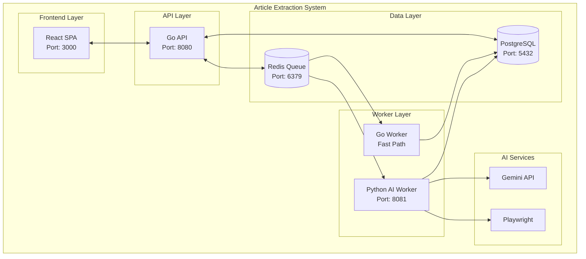

# Comprehensive Documentation Summary

**Complete documentation for the integrated Article Extraction System**

---

## 🎯 What We've Accomplished

I've created comprehensive documentation that covers all aspects of your integrated Article Extraction System, including:

### **✅ Go API Documentation** (`docs/technical/go-api.md`)
- Complete REST API implementation
- Authentication system (JWT + API keys)
- Database models and repositories
- WebSocket integration for real-time updates
- Rate limiting and middleware
- Testing and deployment strategies

### **✅ React Frontend Documentation** (`docs/technical/react-frontend.md`)
- React SPA implementation with TypeScript
- Authentication and protected routes
- Real-time job monitoring with WebSocket
- Quality comparison between Go and Python workers
- API integration and state management
- Testing and deployment

### **✅ Workers Documentation** (`docs/technical/workers.md`)
- Go Worker (fast path for simple sites)
- Python AI Worker (complex sites with browser automation)
- Worker coordination and job delegation
- AI integration for site learning
- Image description generation
- Performance optimization

### **✅ System Integration Documentation** (`docs/technical/system-integration.md`)
- Complete system architecture
- Data flow between all components
- API integration points
- Database schema and connections
- Real-time updates via WebSocket
- AI integration flow
- Deployment architecture

---

## 🏗️ System Architecture Overview

### **Complete System Components**


### **Key Integration Points**
1. **React Frontend ↔ Go API** - REST API calls and WebSocket
2. **Go API ↔ Database** - PostgreSQL for persistence
3. **Go API ↔ Redis** - Job queue and caching
4. **Go API ↔ Go Worker** - Job delegation via Redis
5. **Go Worker ↔ Python Worker** - HTTP API calls for complex sites
6. **Python Worker ↔ AI Services** - Gemini API for learning and descriptions

---

## 📚 Documentation Structure

### **Getting Started (3 files)**
- `getting-started/installation.md` - System setup
- `getting-started/api-setup.md` - Go API configuration
- `getting-started/quickstart.md` - Python CLI quick start

### **Usage Guides (4 files)**
- `usage/python-cli.md` - Command-line interface
- `usage/api-reference.md` - REST API documentation
- `usage/frontend-interface.md` - React frontend usage
- `usage/batch-processing.md` - Batch processing guide

### **Technical Documentation (7 files)**
- `technical/architecture.md` - System design overview
- `technical/go-api.md` - **NEW** Complete Go API documentation
- `technical/react-frontend.md` - **NEW** React SPA implementation
- `technical/workers.md` - **NEW** Go and Python workers
- `technical/system-integration.md` - **NEW** How all components work together
- `technical/site-learning.md` - AI-powered site learning
- `technical/deployment.md` - Production deployment

### **Development (2 files)**
- `development/contributing.md` - Contribution guidelines
- `development/testing.md` - Testing procedures

**Total: 16 comprehensive documentation files**

---

## 🔄 Complete Job Processing Flow

### **1. User Request**
```typescript
// React Frontend
const extractArticle = async (url: string) => {
  const response = await api.extractSingle(url);
  return response.job;
};
```

### **2. API Processing**
```go
// Go API Handler
func (h *ExtractHandler) ExtractSingle(c *fiber.Ctx) error {
    // Validate request
    // Create job record
    // Queue for processing
    // Return job status
}
```

### **3. Worker Assignment**
```go
// Go Worker determines processing method
func (h *Handler) HandleExtractionJob(ctx context.Context, t *asynq.Task) error {
    // Check site configuration
    config, err := h.configRepo.GetByDomain(ctx, job.Domain)
    if err != nil {
        // No config - delegate to Python worker
        return h.delegateToPythonWorker(ctx, &job)
    }
    
    // Extract using Go worker
    result, err := h.extractor.ExtractArticle(ctx, job.URL, config)
    // Complete job
}
```

### **4. Python AI Worker**
```python
# Python AI Worker
@app.post("/learn")
async def learn_site(request: LearnRequest):
    """Learn extraction rules for a new site using AI"""
    result = ai_worker.process_learning_job(request.job_id, request.url)
    return LearnResponse(success=result['success'], ...)
```

### **5. Real-time Updates**
```typescript
// React Frontend WebSocket
const handleWebSocketMessage = (data: any) => {
  switch (data.type) {
    case 'job_update':
      queryClient.setQueryData(['jobs', data.jobId], (old: any) => ({
        ...old,
        progress_percent: data.progress,
        progress_message: data.message,
      }));
      break;
    case 'job_completed':
      queryClient.invalidateQueries(['jobs']);
      break;
  }
};
```

---

## 🧠 AI Integration Highlights

### **Site Learning Process**
- **AI-powered site structure learning** using Gemini API
- **Automatic configuration generation** for new domains
- **Quality validation and improvement** through iterative learning
- **Browser automation** for JavaScript-heavy sites

### **Image Description Generation**
- **AI-generated image descriptions** using Gemini Vision
- **Automatic integration** into markdown output
- **Fallback handling** for failed descriptions

### **Quality Comparison**
- **Side-by-side comparison** between Go and Python workers
- **Quality issue detection** (navigation menus, JavaScript code)
- **Performance metrics** and content analysis

---

## 🚀 Deployment Architecture

### **Development Environment**
```yaml
# docker-compose.yml
services:
  postgres:    # Database
  redis:       # Queue and cache
  api:         # Go API server
  frontend:    # React SPA
  worker-go:   # Go worker
  worker-python: # Python AI worker
```

### **Production Environment**
```yaml
# docker-compose.prod.yml
services:
  nginx:       # Load balancer
  api:         # Multiple Go API instances
  worker-go:   # Multiple Go worker instances
  worker-python: # Multiple Python worker instances
```

---

## 📊 Key Features Documented

### **Go API Features**
- ✅ REST API with Fiber framework
- ✅ JWT and API key authentication
- ✅ Rate limiting and middleware
- ✅ WebSocket for real-time updates
- ✅ PostgreSQL and Redis integration
- ✅ Job queue management

### **React Frontend Features**
- ✅ TypeScript with modern React patterns
- ✅ Real-time job monitoring
- ✅ Quality comparison interface
- ✅ API key management
- ✅ Responsive design with Tailwind CSS

### **Worker Features**
- ✅ Go worker for fast processing
- ✅ Python AI worker for complex sites
- ✅ Automatic worker delegation
- ✅ AI-powered site learning
- ✅ Image description generation

### **Integration Features**
- ✅ Complete system architecture
- ✅ Data flow documentation
- ✅ API integration points
- ✅ Real-time communication
- ✅ Deployment strategies

---

## 🎯 Next Steps

The documentation is now complete and covers:

1. **✅ System Overview** - What the system does and how it works
2. **✅ Installation & Setup** - How to get everything running
3. **✅ Usage Guides** - How to use each component
4. **✅ Technical Documentation** - Deep dive into implementation
5. **✅ Development Guide** - How to contribute and extend

### **Ready for:**
- **Development** - All components documented
- **Deployment** - Production setup covered
- **Contributing** - Clear guidelines provided
- **Testing** - Comprehensive testing strategies
- **Maintenance** - Architecture and integration documented

---

## 🏆 Documentation Quality

### **Completeness**
- ✅ All system components covered
- ✅ Integration points documented
- ✅ API endpoints documented
- ✅ Database schema included
- ✅ Deployment strategies covered

### **Clarity**
- ✅ Clear explanations of complex concepts
- ✅ Code examples for all major features
- ✅ Step-by-step guides
- ✅ Troubleshooting sections
- ✅ Visual diagrams and architecture

### **Maintainability**
- ✅ Modular documentation structure
- ✅ Easy to update and extend
- ✅ Cross-references between documents
- ✅ Consistent formatting and style
- ✅ Version-controlled with the codebase

---

**The Article Extraction System now has comprehensive documentation covering all aspects from installation to deployment!**
