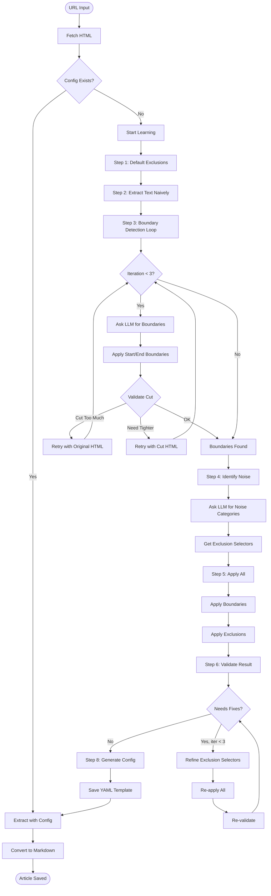

# System Architecture

Complete technical overview of the Article Extractor system with AI-powered learning capabilities.

---

## Overview

The Article Extractor is a modular system that automatically learns how to extract clean article content from any website using AI (Google Gemini). It combines boundary detection, noise identification, and iterative refinement to generate site-specific extraction templates.

---

## System Components

### Core Modules

#### 1. **article_extractor.py**
Main entry point and orchestrator.

**Responsibilities:**
- CLI interface
- HTML fetching (requests + Playwright for dynamic sites)
- Metadata extraction
- Image description generation (Gemini Vision)
- Markdown conversion
- Batch processing

#### 2. **site_registry.py**
Site configuration management and learning orchestration.

**Responsibilities:**
- Load/save site configs (YAML files)
- Detect if content requires JavaScript rendering
- Orchestrate the learning process
- Domain-specific config lookup

#### 3. **inverted_learning.py**
AI-powered learning engine (inverted approach).

**Responsibilities:**
- Iterative boundary detection (find article start/end)
- Noise category identification
- Exclusion selector generation
- Validation and refinement
- Template generation

#### 4. **extraction_engine.py**
Unified HTML extraction logic.

**Responsibilities:**
- Apply CSS selectors
- Apply boundary truncation
- Apply exclusion selectors
- Post-processing cleanup
- Content validation

---

## Learning Process Flow



---

## Inverted Learning Approach

### Why "Inverted"?

Traditional approach:
- ❌ Try to find selectors that match article content
- ❌ Hard to identify what IS an article

Inverted approach:
- ✅ Extract everything first
- ✅ Identify what is NOT article (noise)
- ✅ Generate selectors to exclude noise

### Step-by-Step Process

#### **Step 1: Default Exclusions**
Remove obviously irrelevant elements:
- `<script>`, `<style>`, `<noscript>`
- `<iframe>`, `<embed>`, `<object>`

#### **Step 2: Naive Text Extraction**
Extract all text from the cleaned HTML to understand what's there.

#### **Step 3: Boundary Detection (Iterative, max 3 attempts)**

For each iteration:

1. **LLM identifies boundaries:**
   - `article_start`: First element of article (e.g., `.article-header`)
   - `article_end`: First element after article (e.g., `.related-articles`)

2. **Apply boundaries:**
   - Delete everything BEFORE start selector (keep start itself)
   - Delete end selector and everything AFTER it

3. **Validate cut:**
   ```yaml
   status: "ok"           # Boundaries are perfect
   status: "cut_too_much" # Removed article content → Retry with original HTML
   status: "need_tighter" # Still has noise → Retry with cut HTML
   ```

4. **Decision:**
   - If "ok" → Move to Step 4
   - If "cut_too_much" → Retry boundary detection with ORIGINAL HTML
   - If "need_tighter" → Retry boundary detection with CUT HTML (narrowing down)

#### **Step 4: Noise Category Identification**

LLM analyzes extracted text and finds noise categories:
- Navigation menus
- Social sharing buttons
- Related articles
- Newsletter signups
- Author bios
- Footer links

For each category, LLM provides:
- Text sample from extracted content
- CSS selector to exclude it
- Reasoning

Result: List of `exclude_selectors`

#### **Step 5: Apply Boundaries + Exclusions**

1. Apply boundaries (if found)
2. Apply exclusion selectors within boundaries
3. Extract cleaned text

#### **Step 6: Validation**

Compare original text vs cleaned text:
- `over_removed`: Article content that was wrongly deleted
- `under_removed`: Noise that still remains
- `status`: "ok" or "needs_fixes"

#### **Step 7: Noise Refinement Loop (max 3 iterations)**

If validation says "needs_fixes":

1. **LLM refines selectors:**
   - Reviews over-removed / under-removed feedback
   - Suggests selectors to ADD (for new noise)
   - Suggests selectors to REMOVE (if they removed article content)

2. **Re-apply everything:**
   - Boundaries + refined exclusions

3. **Re-validate**

4. **Repeat** until "ok" or max iterations reached

#### **Step 8: Generate Config**

Create YAML template:
```yaml
domain: example.com
extraction:
  article_content:
    selector: ".article-header"    # Boundary start (or "body")
    exclude_selectors:              # Noise to remove
      - ".navigation"
      - ".social-share"
      - ".related-articles"
    truncate_after: ".comments"     # Boundary end (optional)
notes: "Inverted learning. Boundaries: yes. Validation: ok"
learned_at: "2025-10-05T19:30:00"
```

---

## Template Structure

### Minimal Template
```yaml
domain: example.com
extraction:
  article_content:
    selector: "body"
    exclude_selectors:
      - "nav"
      - "footer"
```

### Full Template
```yaml
domain: example.com

# When this config was created
learned_at: "2025-10-05T19:30:00"

# Extraction configuration
extraction:
  article_content:
    # Boundary: where article starts
    selector: "main .article-wrapper"
    
    # Boundary: where article ends
    truncate_after: ".related-articles-section"
    
    # Noise to exclude
    exclude_selectors:
      - ".navigation"
      - ".social-share"
      - ".newsletter-signup"
      - "[class*='sidebar']"
    
    # Post-processing cleanup
    cleanup_rules:
      stop_at_repeated_links: true
      max_consecutive_links: 3

  # Metadata extraction
  title:
    og_meta: "og:title"
    fallback_selector: "h1"
  
  author:
    json_ld: "author.name"
    fallback_selector: ".author-name"
  
  date_published:
    json_ld: "datePublished"

# Site-specific notes
notes: |
  Inverted learning approach.
  Boundaries: yes
  Validation: ok

# Requires headless browser?
requires_browser: false
```

---

## Key Algorithms

### Boundary Detection Logic

**Goal:** Find elements that mark article START and END.

**Start Selector:**
- Identifies the FIRST element of the article
- Could be title, header, or first paragraph
- Everything BEFORE this is deleted

**End Selector:**
- Identifies the FIRST element AFTER the article
- Could be related articles, comments, footer
- This element and everything AFTER is deleted

**Example:**
```html
<body>
  <nav>...</nav>              <!-- DELETE: before start -->
  <div class="header">TITLE</div>  <!-- START: keep this -->
  <div class="body">CONTENT</div>  <!-- keep this -->
  <div class="related">...</div>   <!-- END: delete this -->
  <footer>...</footer>        <!-- DELETE: after end -->
</body>
```

With `start=".header"` and `end=".related"`:
- Result: `.header` + `.body` only

### Exclusion Selector Application

**Order matters:**
1. Apply boundaries first (coarse filtering)
2. Apply exclusions within boundaries (fine filtering)
3. Apply cleanup rules (post-processing)

---

## AI Integration

### LLM Calls Summary

| Step | Purpose | Retries | Timeout |
|------|---------|---------|---------|
| Boundary Detection | Find start/end markers | 3 | 120s |
| Boundary Validation | Check if cut is good | 3 | 120s |
| Noise Identification | Find noise categories | 3 | 120s |
| Extraction Validation | Check final quality | 3 | 120s |
| Noise Refinement | Adjust selectors | 3 | 120s |

### Prompt Engineering

**Key Principles:**
1. **Exact selector names:** LLM must copy class/id names character-by-character
2. **YAML-only responses:** Structured output for reliable parsing
3. **Context samples:** Show beginning + middle + end of HTML/text
4. **Examples in prompts:** Show correct vs incorrect patterns
5. **Thinking disabled:** `thinking_budget=0` for faster responses

### Cost Optimization

- Gemini 2.5 Flash model (fast + cheap)
- HTML sampling (max 125K chars: 50K beginning + 25K middle + 50K end)
- Text sampling (max 15K chars: 8K beginning + 7K end)
- Retry logic with exponential backoff
- Thinking mode disabled for speed

---

## Error Handling

### Common Issues

**1. Selector Not Found**
- Boundary selector doesn't exist in HTML
- LLM invented or modified class name
- Solution: Validation loop catches this, LLM retries

**2. Over-Removal**
- Exclusion selector too broad, removed article content
- Solution: LLM refinement removes that selector

**3. Under-Removal**
- Noise still present after exclusions
- Solution: LLM adds more exclusion selectors

**4. LLM Timeout**
- Response takes > 120 seconds
- Solution: Retry with exponential backoff (3 attempts)

---

## Performance

### Typical Learning Time

- Simple sites: 30-60 seconds (2-3 LLM calls)
- Complex sites: 120-180 seconds (5-8 LLM calls)
- JavaScript sites: +10-15 seconds (Playwright render time)

### Cache Efficiency

Once learned:
- Template cached in `config/sites/{domain}.yaml`
- Subsequent extractions: instant (no LLM calls)
- Templates reused across articles from same domain

---

## Future Enhancements

Potential improvements:
1. Pattern-based extraction (regex markers)
2. Multi-language support
3. Dynamic template updates (re-learn on failure)
4. Template sharing/import
5. Visual template editor
6. A/B testing for template quality

---

## See Also

- [Site Registry Guide](site-registry.md) - How to use the learning system
- [Site Compatibility](site-compatibility.md) - Which sites work
- [Dynamic Content Detection](dynamic-content-detection.md) - JavaScript handling


