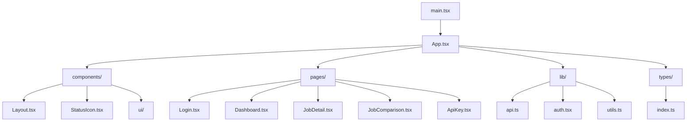

# React Frontend Documentation

**Complete documentation for the React testing interface**

---

## 🎯 Overview

The React frontend is a Single Page Application (SPA) designed for testing and debugging article extraction quality. It provides a visual interface to compare Go worker vs Python worker results, manage API keys, and monitor extraction jobs in real-time.

---

## 🏗️ Architecture

### **Technology Stack**
- **React 18** - UI framework
- **TypeScript** - Type safety
- **Vite** - Build tool and dev server
- **React Router** - Client-side routing
- **React Query** - Server state management
- **Tailwind CSS** - Styling
- **Shadcn/ui** - Component library

### **Component Structure**


---

## 🎨 User Interface

### **Main Dashboard**
```tsx
// pages/Dashboard.tsx
export default function Dashboard() {
  const { user } = useAuth();
  const [url, setUrl] = useState('');
  const { data: jobs, isLoading } = useQuery({
    queryKey: ['jobs'],
    queryFn: fetchJobs,
    refetchInterval: 2000, // Poll every 2s
  });

  const extractArticle = useMutation({
    mutationFn: (url: string) => api.extractSingle(url),
    onSuccess: () => {
      queryClient.invalidateQueries(['jobs']);
    },
  });

  return (
    <div className="max-w-6xl mx-auto p-6">
      {/* URL Input */}
      <div className="mb-8">
        <h1 className="text-2xl font-bold mb-4">Extract New Article</h1>
        <div className="flex gap-4">
          <Input
            value={url}
            onChange={(e) => setUrl(e.target.value)}
            placeholder="https://example.com/article"
            className="flex-1"
          />
          <Button
            onClick={() => extractArticle.mutate(url)}
            disabled={!url || extractArticle.isPending}
          >
            {extractArticle.isPending ? 'Extracting...' : 'Extract Article'}
          </Button>
        </div>
      </div>

      {/* Jobs List */}
      <div className="space-y-4">
        <h2 className="text-xl font-semibold">Recent Extractions</h2>
        {isLoading ? (
          <div>Loading...</div>
        ) : (
          jobs?.map((job) => (
            <JobCard key={job.id} job={job} />
          ))
        )}
      </div>
    </div>
  );
}
```

### **Job Status Indicators**
```tsx
// components/StatusIcon.tsx
export function StatusIcon({ status }: { status: string }) {
  const getStatusConfig = (status: string) => {
    switch (status) {
      case 'completed':
        return { icon: '✅', color: 'text-green-500', label: 'Completed' };
      case 'processing':
        return { icon: '🔄', color: 'text-blue-500', label: 'Processing' };
      case 'learning':
        return { icon: '🧠', color: 'text-purple-500', label: 'Learning' };
      case 'failed':
        return { icon: '❌', color: 'text-red-500', label: 'Failed' };
      default:
        return { icon: '⏳', color: 'text-gray-500', label: 'Queued' };
    }
  };

  const config = getStatusConfig(status);
  
  return (
    <div className={`flex items-center gap-2 ${config.color}`}>
      <span>{config.icon}</span>
      <span className="font-medium">{config.label}</span>
    </div>
  );
}
```

---

## 🔐 Authentication

### **Auth Context**
```tsx
// lib/auth.tsx
interface AuthContextType {
  user: User | null;
  login: (email: string, password: string) => Promise<void>;
  logout: () => void;
  isLoading: boolean;
}

export function AuthProvider({ children }: { children: React.ReactNode }) {
  const [user, setUser] = useState<User | null>(null);
  const [isLoading, setIsLoading] = useState(true);

  useEffect(() => {
    // Check for stored token on mount
    const token = localStorage.getItem('token');
    if (token) {
      api.setAuthToken(token);
      fetchUser().then(setUser).finally(() => setIsLoading(false));
    } else {
      setIsLoading(false);
    }
  }, []);

  const login = async (email: string, password: string) => {
    const response = await api.login(email, password);
    localStorage.setItem('token', response.token);
    api.setAuthToken(response.token);
    setUser(response.user);
  };

  const logout = () => {
    localStorage.removeItem('token');
    api.setAuthToken(null);
    setUser(null);
  };

  return (
    <AuthContext.Provider value={{ user, login, logout, isLoading }}>
      {children}
    </AuthContext.Provider>
  );
}
```

### **Protected Routes**
```tsx
// App.tsx
function PrivateRoute({ children }: { children: React.ReactNode }) {
  const { user, isLoading } = useAuth();

  if (isLoading) {
    return <div>Loading...</div>;
  }

  if (!user) {
    return <Navigate to="/login" />;
  }

  return <Layout>{children}</Layout>;
}
```

---

## 📡 API Integration

### **API Client**
```tsx
// lib/api.ts
class ApiClient {
  private baseURL = import.meta.env.VITE_API_URL || 'http://localhost:8080';
  private token: string | null = null;

  setAuthToken(token: string | null) {
    this.token = token;
  }

  private async request<T>(endpoint: string, options: RequestInit = {}): Promise<T> {
    const url = `${this.baseURL}${endpoint}`;
    const headers: HeadersInit = {
      'Content-Type': 'application/json',
      ...options.headers,
    };

    if (this.token) {
      headers.Authorization = `Bearer ${this.token}`;
    }

    const response = await fetch(url, {
      ...options,
      headers,
    });

    if (!response.ok) {
      throw new Error(`API Error: ${response.status}`);
    }

    return response.json();
  }

  // Authentication
  async login(email: string, password: string) {
    return this.request('/api/v1/auth/login', {
      method: 'POST',
      body: JSON.stringify({ email, password }),
    });
  }

  async register(email: string, password: string) {
    return this.request('/api/v1/auth/register', {
      method: 'POST',
      body: JSON.stringify({ email, password }),
    });
  }

  async getCurrentUser() {
    return this.request('/api/v1/auth/me');
  }

  // Article Extraction
  async extractSingle(url: string) {
    return this.request('/api/v1/extract/single', {
      method: 'POST',
      body: JSON.stringify({ url }),
    });
  }

  async extractBatch(urls: string[]) {
    return this.request('/api/v1/extract/batch', {
      method: 'POST',
      body: JSON.stringify({ urls }),
    });
  }

  // Job Management
  async getJob(jobId: string) {
    return this.request(`/api/v1/jobs/${jobId}`);
  }

  async getJobs(limit = 20, offset = 0) {
    return this.request(`/api/v1/jobs?limit=${limit}&offset=${offset}`);
  }
}

export const api = new ApiClient();
```

---

## 🔄 Real-time Updates

### **WebSocket Integration**
```tsx
// lib/websocket.ts
export function useWebSocket() {
  const [socket, setSocket] = useState<WebSocket | null>(null);
  const { user } = useAuth();

  useEffect(() => {
    if (!user) return;

    const ws = new WebSocket(`ws://localhost:8080/api/v1/ws`);
    
    ws.onopen = () => {
      console.log('WebSocket connected');
      // Send authentication
      ws.send(JSON.stringify({
        type: 'auth',
        token: localStorage.getItem('token'),
      }));
    };

    ws.onmessage = (event) => {
      const data = JSON.parse(event.data);
      handleWebSocketMessage(data);
    };

    setSocket(ws);

    return () => {
      ws.close();
    };
  }, [user]);

  const handleWebSocketMessage = (data: any) => {
    switch (data.type) {
      case 'job_update':
        // Update job progress
        queryClient.setQueryData(['jobs', data.jobId], (old: any) => ({
          ...old,
          progress_percent: data.progress,
          progress_message: data.message,
        }));
        break;
      case 'job_completed':
        // Refresh jobs list
        queryClient.invalidateQueries(['jobs']);
        break;
    }
  };

  return socket;
}
```

---

## 🎯 Quality Comparison

### **Job Comparison View**
```tsx
// pages/JobComparison.tsx
export default function JobComparison({ jobId }: { jobId: string }) {
  const { data: job } = useQuery({
    queryKey: ['job', jobId],
    queryFn: () => api.getJob(jobId),
  });

  const [goContent, setGoContent] = useState<string>('');
  const [pythonContent, setPythonContent] = useState<string>('');

  useEffect(() => {
    if (job?.result_path) {
      // Load Go worker result
      fetch(`/storage/${job.result_path}`)
        .then(res => res.text())
        .then(setGoContent);
    }

    // Load Python baseline for comparison
    const baselinePath = getBaselinePath(job?.url);
    if (baselinePath) {
      fetch(`/results/${baselinePath}`)
        .then(res => res.text())
        .then(setPythonContent);
    }
  }, [job]);

  return (
    <div className="grid grid-cols-2 gap-6">
      {/* Go Worker Result */}
      <div className="border rounded-lg p-4">
        <h3 className="text-lg font-semibold mb-4">Go Worker (Current)</h3>
        <div className="bg-gray-50 p-4 rounded">
          <pre className="whitespace-pre-wrap text-sm">
            {goContent}
          </pre>
        </div>
      </div>

      {/* Python Baseline */}
      <div className="border rounded-lg p-4">
        <h3 className="text-lg font-semibold mb-4">Python (Baseline)</h3>
        <div className="bg-gray-50 p-4 rounded">
          <pre className="whitespace-pre-wrap text-sm">
            {pythonContent}
          </pre>
        </div>
      </div>

      {/* Quality Analysis */}
      <div className="col-span-2">
        <QualityAnalysis 
          goContent={goContent}
          pythonContent={pythonContent}
        />
      </div>
    </div>
  );
}
```

### **Quality Analysis Component**
```tsx
// components/QualityAnalysis.tsx
export function QualityAnalysis({ goContent, pythonContent }: {
  goContent: string;
  pythonContent: string;
}) {
  const issues = detectQualityIssues(goContent, pythonContent);

  return (
    <div className="bg-white border rounded-lg p-6">
      <h3 className="text-lg font-semibold mb-4">Quality Analysis</h3>
      
      {issues.length === 0 ? (
        <div className="text-green-600">✅ No quality issues detected</div>
      ) : (
        <div className="space-y-2">
          {issues.map((issue, index) => (
            <div key={index} className="flex items-start gap-2">
              <span className="text-red-500">❌</span>
              <span>{issue.message}</span>
            </div>
          ))}
        </div>
      )}

      <div className="mt-4 grid grid-cols-3 gap-4 text-sm">
        <div>
          <strong>Go Worker:</strong> {goContent.length.toLocaleString()} chars
        </div>
        <div>
          <strong>Python:</strong> {pythonContent.length.toLocaleString()} chars
        </div>
        <div>
          <strong>Difference:</strong> {Math.abs(goContent.length - pythonContent.length).toLocaleString()}
        </div>
      </div>
    </div>
  );
}

function detectQualityIssues(goContent: string, pythonContent: string) {
  const issues = [];

  // Check for navigation patterns
  const navPatterns = [
    /Skip to content/i,
    /Posts.*Categories.*Tags/s,
    /Home.*About.*Contact/s,
  ];
  
  if (navPatterns.some(p => p.test(goContent))) {
    issues.push({
      message: 'Navigation menus detected in content',
      severity: 'high',
    });
  }

  // Check for JavaScript code
  if (goContent.includes('hbspt.forms') || goContent.includes('portalId')) {
    issues.push({
      message: 'JavaScript code not removed',
      severity: 'high',
    });
  }

  // Check content length difference
  const lengthDiff = Math.abs(goContent.length - pythonContent.length);
  const lengthRatio = lengthDiff / pythonContent.length;
  
  if (lengthRatio > 0.3) {
    issues.push({
      message: `Significant content length difference (${Math.round(lengthRatio * 100)}%)`,
      severity: 'medium',
    });
  }

  return issues;
}
```

---

## 🎨 Styling and UI

### **Tailwind Configuration**
```js
// tailwind.config.js
export default {
  content: [
    "./index.html",
    "./src/**/*.{js,ts,jsx,tsx}",
  ],
  theme: {
    extend: {
      colors: {
        primary: {
          50: '#eff6ff',
          500: '#3b82f6',
          600: '#2563eb',
          700: '#1d4ed8',
        },
      },
    },
  },
  plugins: [],
}
```

### **Component Library**
```tsx
// components/ui/button.tsx
import { ButtonHTMLAttributes, forwardRef } from 'react';
import { cn } from '@/lib/utils';

export interface ButtonProps extends ButtonHTMLAttributes<HTMLButtonElement> {
  variant?: 'default' | 'destructive' | 'outline' | 'secondary' | 'ghost' | 'link';
  size?: 'default' | 'sm' | 'lg' | 'icon';
}

const Button = forwardRef<HTMLButtonElement, ButtonProps>(
  ({ className, variant = 'default', size = 'default', ...props }, ref) => {
    return (
      <button
        className={cn(
          'inline-flex items-center justify-center rounded-md text-sm font-medium transition-colors',
          {
            'bg-primary text-primary-foreground hover:bg-primary/90': variant === 'default',
            'bg-destructive text-destructive-foreground hover:bg-destructive/90': variant === 'destructive',
            'border border-input bg-background hover:bg-accent': variant === 'outline',
            'bg-secondary text-secondary-foreground hover:bg-secondary/80': variant === 'secondary',
            'hover:bg-accent hover:text-accent-foreground': variant === 'ghost',
            'text-primary underline-offset-4 hover:underline': variant === 'link',
          },
          {
            'h-10 px-4 py-2': size === 'default',
            'h-9 rounded-md px-3': size === 'sm',
            'h-11 rounded-md px-8': size === 'lg',
            'h-10 w-10': size === 'icon',
          },
          className
        )}
        ref={ref}
        {...props}
      />
    );
  }
);
```

---

## 🧪 Testing

### **Component Testing**
```tsx
// __tests__/Dashboard.test.tsx
import { render, screen, fireEvent, waitFor } from '@testing-library/react';
import { QueryClient, QueryClientProvider } from '@tanstack/react-query';
import Dashboard from '../pages/Dashboard';

const createTestQueryClient = () => new QueryClient({
  defaultOptions: {
    queries: { retry: false },
    mutations: { retry: false },
  },
});

test('renders dashboard and allows article extraction', async () => {
  const queryClient = createTestQueryClient();
  
  render(
    <QueryClientProvider client={queryClient}>
      <Dashboard />
    </QueryClientProvider>
  );

  // Check if URL input is present
  const urlInput = screen.getByPlaceholderText('https://example.com/article');
  expect(urlInput).toBeInTheDocument();

  // Test URL input
  fireEvent.change(urlInput, { target: { value: 'https://example.com/article' } });
  expect(urlInput).toHaveValue('https://example.com/article');

  // Test extract button
  const extractButton = screen.getByText('Extract Article');
  expect(extractButton).toBeInTheDocument();
});
```

### **API Mocking**
```tsx
// __tests__/api.test.ts
import { api } from '../lib/api';

// Mock fetch
global.fetch = jest.fn();

test('extractSingle calls correct endpoint', async () => {
  (fetch as jest.Mock).mockResolvedValueOnce({
    ok: true,
    json: async () => ({ job: { id: '123', status: 'queued' } }),
  });

  const result = await api.extractSingle('https://example.com/article');

  expect(fetch).toHaveBeenCalledWith(
    'http://localhost:8080/api/v1/extract/single',
    expect.objectContaining({
      method: 'POST',
      body: JSON.stringify({ url: 'https://example.com/article' }),
    })
  );

  expect(result).toEqual({ job: { id: '123', status: 'queued' } });
});
```

---

## 🚀 Build and Deployment

### **Vite Configuration**
```ts
// vite.config.ts
import { defineConfig } from 'vite';
import react from '@vitejs/plugin-react';
import path from 'path';

export default defineConfig({
  plugins: [react()],
  resolve: {
    alias: {
      '@': path.resolve(__dirname, './src'),
    },
  },
  server: {
    proxy: {
      '/api': {
        target: 'http://localhost:8080',
        changeOrigin: true,
      },
      '/storage': {
        target: 'http://localhost:8080',
        changeOrigin: true,
      },
    },
  },
  build: {
    outDir: 'dist',
    sourcemap: true,
  },
});
```

### **Docker Configuration**
```dockerfile
# Dockerfile
FROM node:18-alpine AS builder

WORKDIR /app
COPY package*.json ./
RUN npm ci --only=production

COPY . .
RUN npm run build

FROM nginx:alpine
COPY --from=builder /app/dist /usr/share/nginx/html
COPY nginx.conf /etc/nginx/nginx.conf

EXPOSE 80
CMD ["nginx", "-g", "daemon off;"]
```

### **Environment Variables**
```env
# .env
VITE_API_URL=http://localhost:8080
VITE_WS_URL=ws://localhost:8080
```

---

## 📊 Performance Optimization

### **Code Splitting**
```tsx
// Lazy load pages
const Dashboard = lazy(() => import('./pages/Dashboard'));
const JobDetail = lazy(() => import('./pages/JobDetail'));
const JobComparison = lazy(() => import('./pages/JobComparison'));

// Wrap with Suspense
<Suspense fallback={<div>Loading...</div>}>
  <Routes>
    <Route path="/" element={<Dashboard />} />
    <Route path="/job/:id" element={<JobDetail />} />
    <Route path="/job/:id/compare" element={<JobComparison />} />
  </Routes>
</Suspense>
```

### **React Query Optimization**
```tsx
// Optimize queries
const queryClient = new QueryClient({
  defaultOptions: {
    queries: {
      staleTime: 5 * 60 * 1000, // 5 minutes
      cacheTime: 10 * 60 * 1000, // 10 minutes
      refetchOnWindowFocus: false,
      retry: 1,
    },
  },
});

// Prefetch data
queryClient.prefetchQuery({
  queryKey: ['jobs'],
  queryFn: fetchJobs,
});
```

---

## 📚 Next Steps

- **[Go API Documentation](go-api.md)** - Backend API integration
- **[Worker Documentation](workers.md)** - Go and Python workers
- **[System Integration](system-integration.md)** - How all parts work together
- **[Deployment Guide](deployment.md)** - Production deployment

---

**The React frontend provides an intuitive interface for testing and debugging article extraction quality!**
