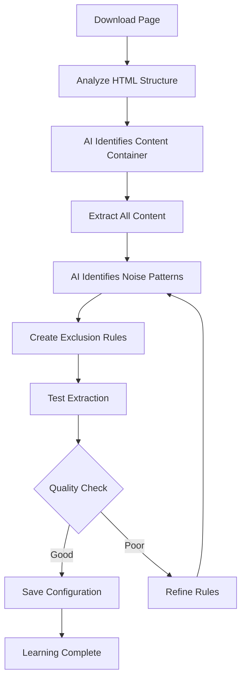

# Site Learning Process

**How the system learns to extract content from new websites**

---

## 🎯 The Learning Challenge

Modern websites are complex. A typical article page contains:
- **Article content** (what we want)
- **Navigation menus** (what we don't want)
- **Sidebar content** (what we don't want)
- **Social sharing buttons** (what we don't want)
- **Related articles** (what we don't want)
- **Advertisements** (what we don't want)
- **Comments sections** (what we don't want)

The challenge: **How do we automatically identify and extract only the article content?**

---

## 🧠 Our Solution: Inverted Learning

Instead of trying to find the content (which varies by site), we:

1. **Start with everything** - Extract the entire page content
2. **Learn what to remove** - Use AI to identify noise patterns
3. **Iteratively improve** - Remove unwanted content step by step
4. **Validate results** - Check if the remaining content is clean

This approach works better because:
- It's easier to identify what to remove than what to keep
- It adapts to different website structures automatically
- It learns from mistakes and improves over time

---

## 🔄 Learning Process Flow



---

## 🤖 AI-Powered Learning

### **Step 1: Content Container Identification**
The AI analyzes the HTML structure to find the main article container:

```yaml
# AI identifies patterns like:
extraction:
  article_content:
    selector: "div.post-content"  # Main content container
    fallback: "body"             # Fallback if main selector fails
```

### **Step 2: Noise Pattern Detection**
The AI identifies common noise patterns:

```yaml
exclude_selectors:
  - "nav"                       # Navigation menus
  - "header"                    # Page headers
  - "footer"                    # Page footers
  - "[class*='share']"          # Social sharing buttons
  - "[class*='related']"       # Related articles
  - "[class*='ad']"            # Advertisements
  - ".comments"                 # Comments sections
```

### **Step 3: Iterative Refinement**
The system tests the extraction and refines the rules:

```python
# Pseudo-code for the learning loop
for iteration in range(max_iterations):
    # Extract content with current rules
    content = extract_with_rules(html, config)
    
    # Validate quality
    is_valid, feedback = validate_extraction(content)
    
    if is_valid:
        save_configuration(config)
        break
    else:
        # Ask AI to improve rules based on feedback
        config = ai_improve_rules(config, feedback)
```

---

## 📊 Quality Validation

### **What We Check For**
- **Content completeness** - Is the article complete?
- **Noise detection** - Are there navigation menus in the content?
- **Structure quality** - Does the content have proper headings?
- **Metadata accuracy** - Are title, author, and date correct?

### **Validation Criteria**
```python
def validate_extraction(content):
    issues = []
    
    # Check for navigation patterns
    if contains_navigation(content):
        issues.append("Navigation menus detected")
    
    # Check for JavaScript code
    if contains_javascript(content):
        issues.append("JavaScript code not removed")
    
    # Check content length
    if len(content) < 1000:
        issues.append("Content too short")
    
    # Check for proper structure
    if not has_proper_headings(content):
        issues.append("Poor content structure")
    
    return len(issues) == 0, issues
```

---

## 🎯 Learning Triggers

### **When Learning Happens**
- **New site** - First time extracting from a domain
- **Poor quality** - Extraction returns navigation or ads
- **Force renewal** - User explicitly requests re-learning
- **Site changes** - Previously working site now fails

### **Learning Indicators**
```
🤖 LEARNING NEW SITE: newsite.com
📥 Downloading page...
🔍 Analyzing HTML structure...
🧠 Asking AI for extraction rules...
✅ Config received from AI
🔍 Testing extraction...
✅ Extraction successful: 2,847 characters
💾 Saving configuration...
✅ Site learned successfully!
```

---

## 📁 Configuration Storage

### **Site Configuration Format**
```yaml
domain: example.com
extraction:
  article_content:
    selector: "div.post-content"
    fallback: "body"
    exclude_selectors:
      - "nav"
      - "header"
      - "footer"
      - "[class*='share']"
      - "[class*='related']"
  title:
    selector: "h1"
    fallback: "title"
  author:
    selector: ".author"
    fallback: "[itemprop='author']"
  date_published:
    selector: "time[datetime]"
    fallback: ".date"
requires_browser: false
learned_at: "2025-01-02T15:30:00Z"
notes: "Learned successfully with 95% accuracy"
```

### **Configuration Location**
```
config/sites/
├── example.com.yaml
├── newsite.com.yaml
└── complex-site.com.yaml
```

---

## 🔧 Learning Configuration

### **AI Model Settings**
```python
# Gemini configuration for learning
config = {
    "temperature": 0.1,        # Low creativity for consistent results
    "top_p": 0.95,            # High diversity for pattern recognition
    "max_tokens": 8192,       # Large context for complex HTML
    "thinking_budget": 0      # Disable thinking for faster responses
}
```

### **Learning Parameters**
```python
learning_config = {
    "max_iterations": 3,      # Maximum learning attempts
    "min_content_length": 1000, # Minimum acceptable content length
    "quality_threshold": 0.8,  # Minimum quality score
    "timeout_seconds": 60     # Maximum learning time
}
```

---

## 🎨 Advanced Learning Features

### **Dynamic Content Detection**
```python
# Detect if site requires JavaScript
def requires_browser(html):
    indicators = [
        "window.location",
        "document.addEventListener",
        "React.createElement",
        "Vue.component"
    ]
    return any(indicator in html for indicator in indicators)
```

### **Site-Specific Adaptations**
```python
# Adapt learning strategy based on site type
if "wordpress" in html.lower():
    strategy = "wordpress_learning"
elif "elementor" in html.lower():
    strategy = "elementor_learning"
elif "react" in html.lower():
    strategy = "spa_learning"
else:
    strategy = "generic_learning"
```

---

## 📊 Learning Analytics

### **Success Metrics**
- **Learning success rate** - Percentage of sites learned successfully
- **Extraction accuracy** - Quality of extracted content
- **Learning time** - Time taken to learn a new site
- **Rule effectiveness** - How well learned rules work

### **Quality Indicators**
```python
quality_metrics = {
    "content_length": 2500,      # Characters in extracted content
    "noise_ratio": 0.05,         # Percentage of unwanted content
    "structure_score": 0.9,      # Quality of content structure
    "metadata_completeness": 0.95 # Percentage of metadata extracted
}
```

---

## 🔄 Continuous Improvement

### **Learning from Failures**
```python
# When extraction fails, learn from the failure
def learn_from_failure(html, failed_config, error):
    # Analyze what went wrong
    failure_analysis = analyze_failure(html, failed_config, error)
    
    # Generate improved configuration
    improved_config = ai_improve_config(failed_config, failure_analysis)
    
    # Test the improved configuration
    return test_configuration(html, improved_config)
```

### **Rule Evolution**
```python
# Rules can evolve over time
def evolve_rules(domain, current_config, new_html):
    # Check if site structure has changed
    if site_structure_changed(current_config, new_html):
        # Re-learn with updated structure
        return relearn_site(domain, new_html)
    else:
        # Keep existing rules
        return current_config
```

---

## 🎯 Best Practices

### **For Learning New Sites**
1. **Use representative articles** - Choose typical articles from the site
2. **Test multiple articles** - Verify rules work across different pages
3. **Monitor quality** - Check extraction results regularly
4. **Update when needed** - Re-learn if site structure changes

### **For Site Maintenance**
1. **Regular validation** - Test learned sites periodically
2. **Quality monitoring** - Track extraction quality metrics
3. **Rule updates** - Update rules when site structure changes
4. **Performance optimization** - Optimize rules for better performance

---

## 📚 Next Steps

- **[System Architecture](architecture.md)** - Complete system overview
- **[Python CLI Usage](../usage/python-cli.md)** - Learn how to use learning features
- **[API Reference](../usage/api-reference.md)** - Use learning via API

---

**The learning process is the heart of the system - it's what makes it work with any website!**


